<!--
    To generate the readme, run:

    docker run -ti --rm -v DOLLARSIGN(pwd):/test/usr maltegruber/readme-tex:1.0.0

    see: https://github.com/MalteGruber/readme-tex

-->

# 'The chase' implementation

This contains implementations of some papers on the chase. I'll attempt to summarize the what and why of the chase below.

## Background - relational algebra

Connected with relational databases that you might be more familiar with is the concept of *relational algebra*. What we called tables are now called *relations*, which we can think of as sets of tuples of some fixed length. Importantly we can ask whether a given tuple  is an element of a given relation 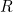, i.e. is it the case that ? We can isolate particular attributes of a tuple by projection, which we could use subscripts for: e.g. if the previous tuple was , then 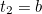. It's easiest to visualize the relations as tables:

We can use [first-order logic](https://www.javatpoint.com/first-order-logic-in-artificial-intelligence) to express constraints. We can express that "`Employee` is a *primary key* of `Manage`" by 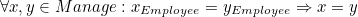. We can express that "`Likee` is a *foreign key* " by writing 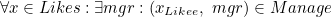

Now suppose we have a database  and a set constraints , we can ask whether  satisfies . If not, we can imagine there being the best or nearest-relative of  that *does* satisfy . **The chase** is an algorithm that finds this other database, given  and . The remaining background material to cover concerns how to define this notion of a "best" relative of .

## Background - database homomorphisms

One interesting relationship between databases is whether one is a subset of the other.

We'll consider single-relation database instances in this section to keep the examples small, which allows us to abuse notation and treat the relations as databases in their own right. In the above examples, we could say 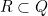 to mean one database is a subset of the other.

Although all example databases above have been fully specified, generally databases in this formalism can have "labeled nulls" which behave like variables.

This new instance 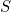 says there's a tuple that has two of the same unknown value, and another which has an unknown first value and  for the second value. We need to refine our notion of  in light of the possibility of labeled nulls. The relevant relation now is called a *homomorphism* () which consists in an assignment to the labeled nulls in  such that, when substituting  with this assignment, we get a database instance that is literally a subset of . For example, the assignment 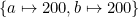 is a homomorphism 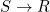. There is no homomorphism . ( is a homomorphism trivially, no substitution needed; for any  we have 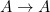, given we can make an identity substitution).

Even with merely a simple binary relation like , we can derive a notion of the 'closest' related 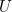 for some given . Fix a given  of constraints and imagine the set of all possible instances which both satisfy  and are related to . Among this set, it may be the case that there exists a  such that 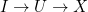 for all  instances in this set, i.e. *any* homomorphism can be factored through a homomorphism with .

(Analgously, consider the relation  for integers, let 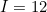 and  ... we want something that is 'related' to , so we are looking for an  such that  which also satisfies the constraints. There exist 5 possible candidates ( through  inclusive) and it happens that for any candidate  we can write  with the value of 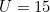. Thus, 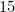 is the 'closest' integer to  that satisfies the constraints.)

The database instance  that satisfies this property is called *universal* (with respect to 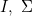), and this is the instance that the chase returns, if it exists.

## Why
Reading about what the chase is and how it works will be more interesting with context as to why finding a universal database instance is of interest.
- Query Optimization
- Constraint Implication
- Universal Solutions / Data Exchange
- Certain Answers

## What
The simplest variation of the chase considers each constraint as a potential trigger which can be *fired* to produce a new instance that satisfies that constraint. We then iteratively repeat this process until there exist no active triggers (i.e. produce a sequence of instances until we arrive at one which satisfies the constraints).

The literature is generally concerned with two types of constraints.
- Tuple-generating dependencies: *if* there exist some tuples satisfying such-and-such conditions, *then* there must exist these other tuples satisfying such-and-such conditions. To *fire* this constraint is to add the tuples in the consequent clause.
- Equality-generating dependencies: *if* there exist some tuples (which involve two variables, say  and ) satisfying such-and-such conditions, *then* 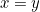. To *fire* this constraint is to take all instances of  and replace them with  (or vice-versa). If both  and 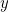 match with constants which have different values, then the chase fails.
- In both cases, there is a clear antecedent condition to check to see if the trigger is *active*.

It's possible for the sequence of instances generated by firing constraints to never terminate. For some simple chase implementations, this doesn't imply that a universal solution doesn't exist. However, more sophisticated implementations (such as the *core* chase) are complete, meaning they terminate iff there exists a solution.

## References
1. Gösta Grahne and Adrian Onet. *Anatomy of the Chase*. Fundamenta Informaticae. **157** (2018) *221–270*.
2. Alin Deustch, Alan Nash, and Jeff Remmel. *The chase revisited*. PODS (2008).