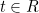
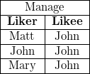
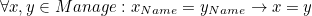
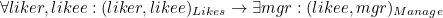
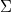
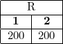
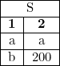
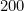

<!--
    To generate the readme, run:

    docker run -ti --rm -v DOLLARSIGN(pwd):/test/usr maltegruber/readme-tex:1.0.0

    see: https://github.com/MalteGruber/readme-tex

-->

# 'the chase' implementation

This contains implementations of some papers on the chase. I'll attempt to summarize the what and why of the chase below.

## Background - relational algebra

Connected with relational databases that you might be more familiar with is the concept of *relational algebra*. What we called tables are now called *relations*, which we can think of as sets of tuples of some fixed length. Importantly we can ask whether a given tuple  is an element of a given relation , i.e. is it the case that ? We can represent a tuple as being an element of  in particular by a subscript . We can also isolate particular attributes of a tuple by projection, which we could use subscripts for again: e.g. if the previous tuple was  then .

We can use first-order logic to express constraints. We can express that "`Name` is a *primary key* of `Manage`" by . We can express that "`likee` is a *foreign key* " by writing 

Now suppose we have a database  and a set constraints , we can ask whether  satisfies . If not, we can imagine there being the best or nearest-relative of  that *does* satisfy . The chase is an algorithm that finds this other database given  and . The remaining background material to cover concerns how define this notion of a "best" relative of .

## Background - database homomorphisms

One interesting relationship betweeen databases is whether one is a subset of the other.

We'll consider single-relation database instances in this section to keep the examples small, which allows us to abuse notation and treat the relations as databases in their own right. In the above examples, we could say .

Our example databases were fully specified, but in general databases in this formalism can have "labeled nulls" which behave like variables.

This new version of  says there's a tuple that has two of the same unknown value, and another which has an unknown first value (not necessarily distinct from the first tuple) and  for the second value.

The instance that the chase returns is *universal*.

## What

## Why

## References
1. Gösta Grahne and Adrian Onet. *Anatomy of the Chase*. Fundamenta Informaticae 157 (2018) 221–270
2.