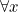

<!--
    To generate the readme, run:

    python -m readme2tex --output README.md .README.md
-->

# 'the chase' implementation

This contains implementations of some papers on the chase. I'll attempt to summarize the what and why of the chase below.

## Background

Connected with relational databases that you might be more familiar with is the concept of *relational algebra*. What we called tables are now called *relations*, which we can think of as sets of tuples of some fixed length. We can use first order logic to express constraints.

### Likes
| liker| likee |
|------|--------|
| Matt | John   |
| John  |  John |
| John | Mary   |
### Manage
|  name| manager |
|------|--------|
| Matt | John   |
| John |  John |
| Mary | John   |

We can express that "`Name` is a primary key of `Manage` by . We can express that `likee` is a foreign key 

## What

## Why

## References
1. Gösta Grahne and Adrian Onet. *Anatomy of the Chase*. Fundamenta Informaticae 157 (2018) 221–270
2.